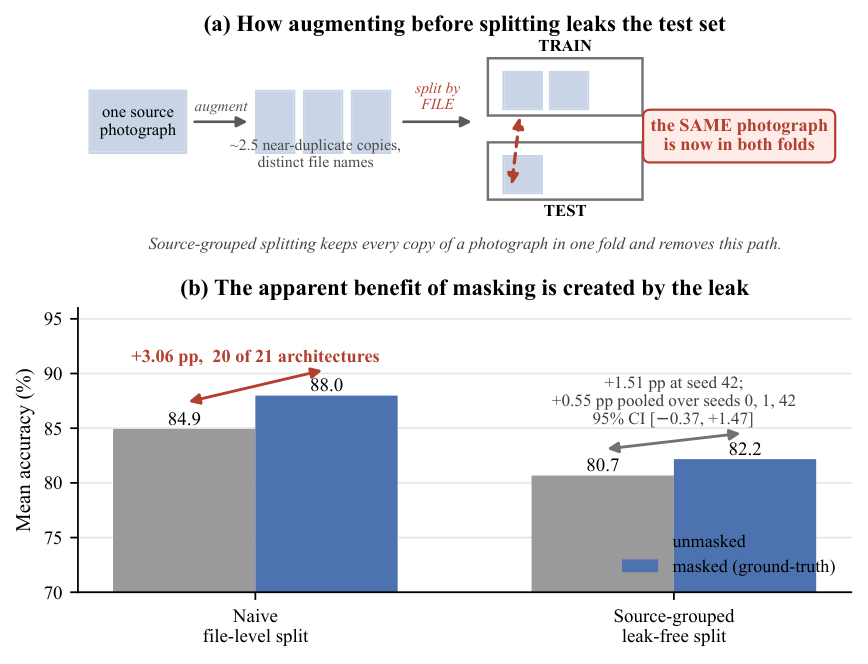
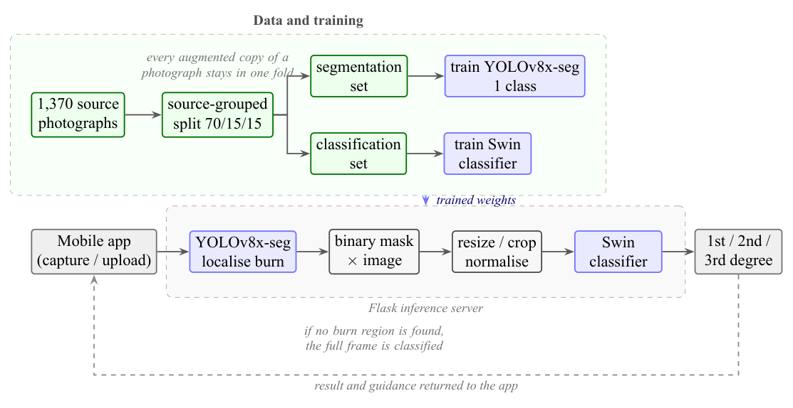
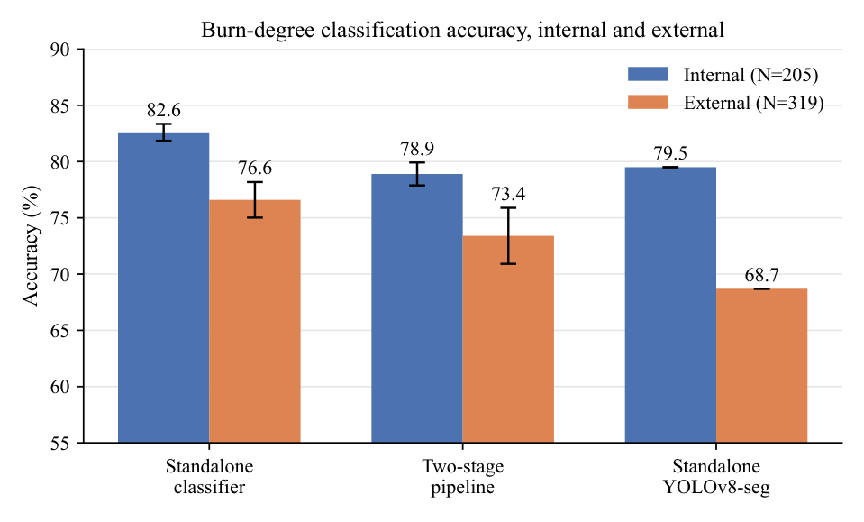
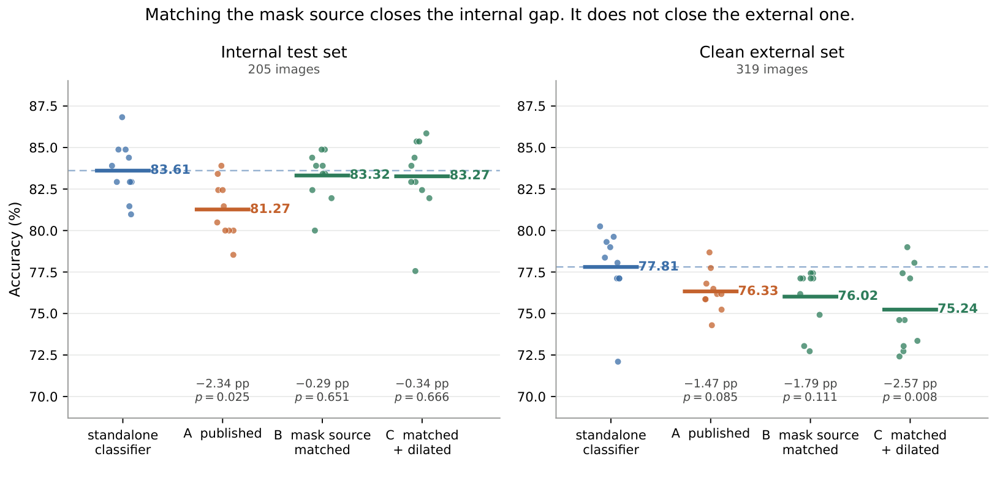
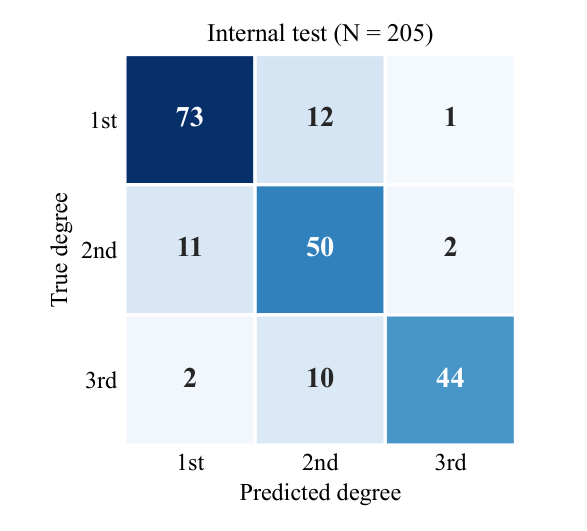
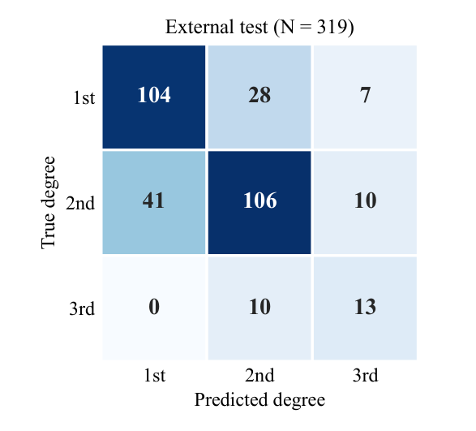

# When Leakage Changes the Conclusion: A Methodological Evaluation of Segmentation-Guided Burn Severity Classification

[](LICENSE)
[](LICENSE-DATA)
[](verify_paper_numbers.py)

Code, data and every raw result behind the paper.

> **The finding in one line: leakage here did not inflate a score, it changed the conclusion.**
> The two arms of our comparison had been partitioned separately, so 80.5% of the test set leaked
> in one and none in the other. That did not raise a number — it manufactured a design
> recommendation, consistently across 20 of 21 architectures.

**The question.** A burn photograph contains the wound and a great deal besides: unburned skin,
dressings, bedding, the room. A classifier trained on whole images may read the setting rather than
the injury — and in a web-sourced collection the setting correlates with severity for reasons that
have nothing to do with tissue. The obvious remedy is to segment the burn and grade only what
remains. That design is standard elsewhere in medical imaging but had never been tested for burns
against the simpler alternative it is meant to improve on. This repository is the test.

```bash
pip install numpy scipy
python verify_paper_numbers.py     # recomputes 205 published numbers from the raw data
```

No GPU, no dataset download, no model weights, under a minute. Two of the checks exist
specifically to catch us overstating our own results.

---

## How much the evaluation protocol decides the answer

Seven evaluation choices, each conventional in this literature, each of which changed the answer
we obtained. Reported because a reader cannot judge the result without them.

| # | Routine choice | Appeared to show | After correction |
|---|---|---|---|
| 1 | Split augmented files at random | Masking helps: **+2.07 pp** (8 matched architectures; +3.06 across all 21) | **+0.55 pp**, 95% CI [−0.37, +1.47], Wilcoxon *p* = 0.32 |
| 2 | Group by source ID and assume the folds are independent | The folds are independent | **2 of 205** test images are perceptually identical to a training image filed under a different ID; one pair carries conflicting labels |
| 3 | Use three training seeds | Internal +3.74 [+3.04, +4.44], *p* = 0.002; external *p* = 0.19 | Ten seeds: internal +2.63 [+0.29, +4.98]; external **+2.79** [+1.09, +4.49], *p* = 0.005. Of all **120** three-seed subsets of those same ten runs, only **15** detect the external effect |
| 4 | Test a subgroup on one dataset | Errors fall on darker skin: median ITA 19.2 vs 38.4, *p* = **0.0025**, survives Bonferroni | External replication *p* = 0.35, **effect reversed**, on a larger cell (139 vs 81 images) |
| 5 | Correct the split for one stage, assume the pipeline is clean | The head-to-head is leak-free | **179 of 205** internal test images (87.3%) sat in the segmentation models' training *or validation* folds. Retrained: standalone falls 90.7 → **78.0%**. But re-scoring the *pipeline* on the corrected localiser moves it only 80.98 → 80.88% — the leak did not propagate to the arm that mattered |
| 6 | Summarise accuracy the usual way | Classifier beats pipeline internally: **+2.63 pp**, *p* = 0.032 | On **balanced** accuracy the same ten runs give **+1.45 pp** [−0.74, +3.65], *p* = **0.17** — not established. Only the external margin survives both summaries |

| 7 | Take the best architecture as the comparison arm | ConvNeXt-Large is the best Benchmark 1 condition, 84.88% | Best **on test**. On validation Swin-Tiny wins and scores 82.44%. The seed-42 margin falls +3.41 → +0.98 pp: honest selection removes **71%** of the internal margin |

The seventh is the one that costs most: we selected the comparison arm on the set we then scored it
on, so **we report no internal effect estimate.** The external comparison is what the paper rests on.

---

## The finding that started it



The source collection augments each photograph into about 2.5 near-duplicate copies with distinct
file names. Split those files at random and copies of one photograph land in both training and
test. In our masked classification set **80.5%** of test images shared a source photograph with
training; the separately partitioned unmasked set leaked none.

Leakage did not inflate a score here — it manufactured a *comparative conclusion*, consistently
across 20 of 21 architectures. **When a leak rate differs between the arms being compared,
consistency across architectures is evidence for the confound rather than against it.**

## The system under test



The 1,370 source photographs are partitioned **once, by photograph rather than by file**, and that
one partition defines the folds for both models. At inference a YOLOv8x-seg localiser predicts a
burn mask, the mask is multiplied into the image, and a Swin transformer grades what remains.
Served through Flask and Flutter. **It is a research and demonstration artifact, not a clinically
validated device** — and as the external results show, it
is not ready for any clinical role.

## What the benchmark found



Ten training runs per arm, each seed joined to itself across the two arms. A plain classifier leads
on both test sets. But the runs overlap, and internally three of ten seeds cross — which is why this
plots ten seeds and not the three our original protocol used.

## Old pipeline vs. new pipeline



The published pipeline trained its classifier on ground-truth masks and then showed it *predicted*
masks at test time. Repairing that mismatch is worth **+2.05 pp** internally and closes the internal
gap. Externally it closes nothing.

> **Corrected during final audit.** Regime B is the best configuration *on test*. Ranked on
> **validation** — the honest basis — the order reverses: C 84.37, B 83.45, A 83.35. Against the
> validation-selected regime C the external difference from the classifier **is** resolved
> (**+2.57 pp**, 95% CI [+0.87, +4.27], *p* = 0.008), where against test-selected B it is not
> (*p* = 0.11). So we **withdraw the external parity claim**. Internal parity survives either
> choice (*p* = 0.65 for B, 0.67 for C). This was our own audit #7 committed in the section that
> answers it — see `verify_paper_numbers.py` checks 30.

Segmentation-first reaches **internal parity at best, never advantage** — and runs two models to
get there.

## Where it fails

 

On the independent clinical database the model does not transfer at all. On a perceptual-hash-cleaned
web-sourced external set it fails in the dangerous direction, under-grading **28.3%** of the images
that could be under-graded against 19.3% internally — a difference that is *not* itself significant
(*z* = 1.77, *p* = 0.08). Under-grading routes a severe burn toward conservative care.

---

## Layout

```
verify_paper_numbers.py        ← start here: 205 checks, no GPU, under a minute
paper/                         manuscript source + PDF, bibliography, cover letter, submission guide
code/
  skin_tone_probe.py           ITA fairness probe (audit 4)
  build_seg_split_leakfree.py  rebuilds the segmentation split (audit 5) — refuses to emit a leaking dataset
  rerun_standalone_yolo.py     re-scores the standalone model at conf 0.05
  make_fig_h2h.py              regenerates the ten-seed head-to-head figure
  make_fig_regimes.py          regenerates the published-vs-best-configuration figure
  make_fig_qualitative.py      regenerates the qualitative panel (needs weights)
  kaggle-notebooks/            the retraining runs, exactly as executed
benchmark2-proof/results/      per-image predictions behind every table and figure
statistics/                    raw result JSON for every reported analysis
figures/                       figures as PDF, plus PNG renders for this page
apps/                          the deployed Flask + Flutter system (source only)
docs/                          supporting notes
```

## Trained weights

Attached to the [`v1.0-melba` release](../../releases/tag/v1.0-melba) — each exceeds GitHub's
100 MB per-file limit.

| File | What it is |
|---|---|
| `yolov8x-seg_1class_LEAKFREE.pt` | Localiser, source-grouped split. Test mask mAP50 **0.695** |
| `yolov8x-seg_3class_LEAKFREE.pt` | Standalone, source-grouped split. mAP50 0.566; **78.0%** internal, **66.8%** external |
| `yolov8x-seg_1class__best.pt` | The original localiser — **contaminated**, see audit 5 |
| `yolov8x-seg_3class__best.pt` | The original standalone — **90.7%** internal but only **48.9%** external. That 41.8-point collapse against the retrained model's 11.2 is the leakage signature |
| `swin-small_masked__best_cnn_mask.pth` | The classifier shipped in the mobile demonstration |

We publish the **contaminated models alongside the corrected ones deliberately**, so the leak can
be reproduced as readily as its correction.

> **Closed.** The benchmark's original Swin-Tiny weights were never archived, so we retrained all
> ten under the original per-seed recipe and re-scored the pipeline arm on the corrected localiser.
> The effect is negligible (80.98 → 80.88%). Raw runs in
> `statistics/pipeline_arm_leakfree_localiser.json`; the notebook is in `code/kaggle-notebooks/`.

## Data

| Source | Availability |
|---|---|
| Primary: Roboflow "skin burn wound classification" v31 | Public, CC BY 4.0. **No source photograph is redistributed here** |
| External: a second Roboflow collection, pHash-screened | Split definition and contamination lists included |
| BIP_US clinical database (Univ. Seville) | On request from its custodians. **No BIP_US image is redistributed** |

> **On patient images.** This repository deliberately contains **no source photographs**. Earlier
> revisions included Ultralytics validation mosaics (`val_batch*.jpg`) written automatically during
> segmentation training; those tile the underlying dataset images, some of which show identifiable
> faces. They have been deleted and purged from the Git history, and the release was recreated from
> the cleaned tree. The primary collection is CC BY 4.0, so redistribution would have been
> *permitted* — but a licence permitting redistribution is not a reason to republish identifiable
> medical photographs, and those files contributed nothing to reproducing any result. Everything
> needed to reproduce the paper (weights, code, per-image predictions, statistics, split
> definitions) is here; the images themselves come from the sources cited above.
>
> If you cloned or forked this repository before this change, please delete your copy of those
> files.

## Licence

Code **MIT** ([LICENSE](LICENSE)) · everything else — figures, predictions, statistics, split
definitions, weights — **CC BY 4.0** ([LICENSE-DATA](LICENSE-DATA)).

## The full story

[`docs/PROJECT_COMPLETE_REPORT.md`](docs/PROJECT_COMPLETE_REPORT.md) is a ~10,000-word technical
account of the whole project: the idea and why we expected masking to help, the system, the data,
the literature, every experiment in the order it was run, the seven evaluation choices that changed
our answers, the reproducibility infrastructure, the publication process, and an honest post-mortem
of what we would do differently.

## Citing

See [`CITATION.cff`](CITATION.cff).

---

*This work began as an undergraduate graduation project at the Faculty of Computer and Information
Systems, Islamic University of Madinah. All three authors have since graduated; the analyses
reported here were carried out independently, without institutional supervision, funding or
compute.*
