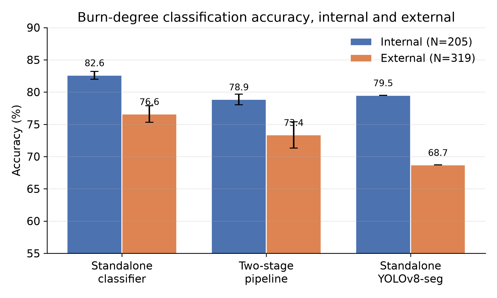
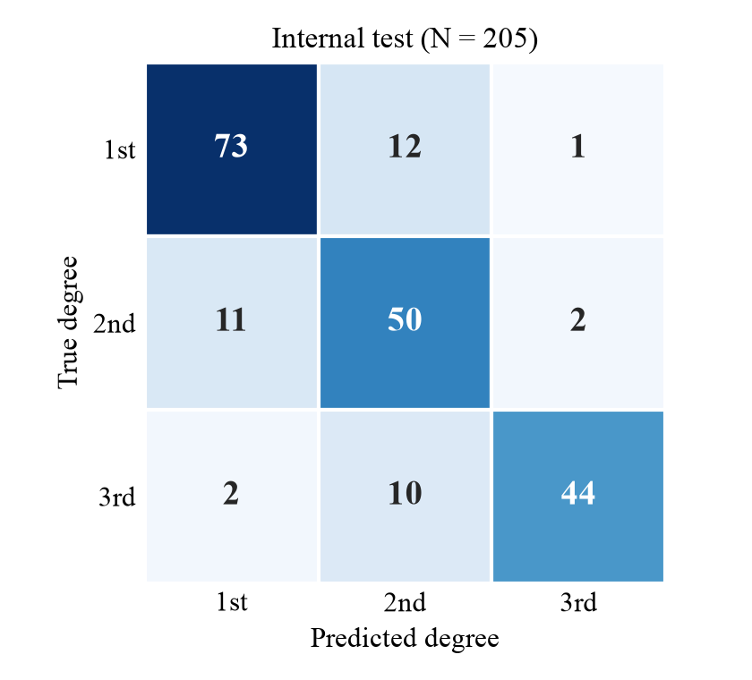
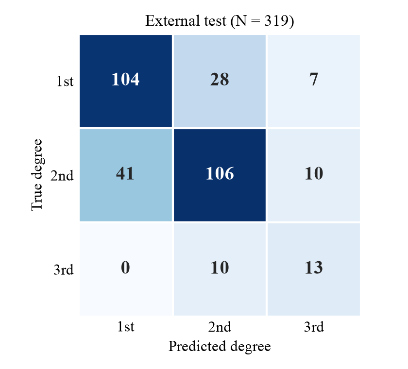

# A comparative study of deep learning approaches for automated burn injury segmentation and severity classification

Code, statistics, and reproducibility materials for the paper of the same name. This
repository accompanies a study of deep learning for burn severity classification (first,
second, and third degree) from photographs. Its central result is a cautionary one:
**in-distribution accuracy is not evidence of clinical usefulness; leak-free external
evaluation is.**

## Summary of findings

We describe a deployed two-stage system (a YOLOv8x-seg localiser feeding a masked Swin
transformer classifier, served through a Flutter and Flask mobile application) and build a
leak-free, fair benchmark around it that gives every approach its best honest chance.

**1. A data-leakage artifact manufactured an apparent benefit.**
On a naive file-level split of the augmented dataset, masking appeared to help 20 of 21
architectures (mean +3.06 percentage points). This is an artifact: because the source
dataset augments each photograph into several near-duplicate copies, a file-level split
placed copies of one photograph in both folds, leaking **80.5%** of the masked test set
while the unmasked split leaked none.

**2. On a leak-free split, masking gives no reliable benefit.**
Grouping by the 1,370 unique source photographs (70/15/15, seed 42; validation/test
deduplicated to one image per source → 206/205) collapses the effect to **+0.55 pp**
pooled over seeds 0, 1, and 42 — not significant (Wilcoxon *p* = 0.32), and below the
study's minimum detectable effect of ~3.64 pp at *N* = 205. Cropping gives ~0.0 pp.

**3. A plain classifier is the most accurate single system.**
Multi-seed head-to-head (seeds 0, 1, 2; mean ± SD) on the shared 205-image internal test
set and a clean 319-image external set:

| System | Internal (N=205) | External (N=319) |
|---|---|---|
| Standalone classifier (ConvNeXt-Large) | **82.6 ± 0.6** | **76.6 ± 1.3** (bal. 80.1 ± 1.5) |
| Robust pipeline (localiser → Swin-Tiny) | 78.9 ± 0.8 | 73.4 ± 2.0 (bal. 77.9 ± 2.7) |
| Standalone YOLOv8-seg (single seed, conf. 0.05) | 79.5 | 68.7 (bal. 74.6) |
| *Oracle Swin-Tiny (ground-truth masks)* | *83.9* | *n/a* |
| *Strict pipeline (conf. 0.25, no-detection = error)* | *79.0* | *54.2* |

The classifier wins on both sets in all three seeds. Paired McNemar on the seed-42 models
gives *p* = 0.87 internally and *p* = 0.18 externally — so we describe the advantage as
**consistent across seeds rather than statistically significant in a single run**.

<p align="center">
  
</p>

<sub><b>Head-to-head accuracy.</b> Error bars are the standard deviation across seeds 0, 1, 2
for the classifier and the pipeline; the standalone YOLOv8-seg model is single-seed and shown
without error bars. Differences fall within the cross-seed spread.</sub>

**4. The model does not transfer to clinical images.**
On the BIP_US clinical database (94 photographs) balanced accuracy is 30.5% / 35.0%
(depending on the deep-dermal mapping) against a 50% chance level for that two-class probe,
with systematic **under-grading** — the dangerous direction. On the web-sourced 319-image
external set the decline is milder and the plain classifier remains most robust. A
perceptual-hash check removed 118 training-identical images and 28% of sources (56/199)
before that evaluation.

<table>
<tr>
<td align="center"></td>
<td align="center"></td>
</tr>
<tr>
<td align="center"><sub>Internal test (N = 205)</sub></td>
<td align="center"><sub>Clean external test (N = 319)</sub></td>
</tr>
</table>

<sub><b>Confusion matrices for the robust two-stage pipeline</b> (representative seed). Internally,
errors fall mainly between neighbouring degrees, with second degree the hardest class.
Externally, accuracy drops and the more severe burns are frequently <b>under-graded</b> — the
dangerous direction.</sub>

**Segmentation quality:** single-class localiser test mask mAP50 **0.726** (mAP50-95 0.417);
three-class standalone **0.603** (0.349).

**Efficiency (A100, 640×640, batch 1):** localiser 15.4 ms, Swin-Tiny 23.7 ms,
ConvNeXt-Large 25.8 ms, full pipeline 42.3 ms (~1.6× slower than the standalone classifier).

**Conclusion.** Segmentation-first is not justified on accuracy grounds here; its value is
localisation and interpretability. Datasets augmented before splitting must be partitioned
by source image, or reported gains may be illusory.

## Verify the paper's numbers in one command

Every headline number in the article is recomputed from the raw data committed here — no GPU,
no dataset download, no model weights required:

```bash
pip install numpy scipy
python verify_paper_numbers.py
```

This checks **136 quantities** against what the manuscript prints: the leakage artifact and the
matched-architecture-pool contrast (2.07 -> 0.55), the masking null (including the Wilcoxon and
Mann-Whitney tests), the multi-seed and ten-seed head-to-head means, standard deviations and
paired intervals, all 120 three-seed subsets of the ten runs, the interval-narrowing factors, the
exact McNemar tests recomputed from per-image predictions, segmentation mAP, the oracle-mask upper
bound, both pipeline variants, the timing table, the BIP_US balanced accuracy, the skin-tone (ITA)
probe and its failure to replicate, and the source-clustered bootstrap intervals on the external
set. **All 136 currently pass.**

Two of these checks exist specifically to catch us overstating our own results: check 13 confirms
that the leakage contrast is 2.07 -> 0.55 on matched architecture pools rather than the larger
3.06 -> 0.55, and check 15 confirms that the internal interval-narrowing factor is 3.35, not the
"four times" an earlier draft claimed.

## Repository structure

```
apps/                            # the deployed system (source only) — see apps/README.md
  flask-server/                  #   POST /analyze — YOLOv8x-seg → mask → Swin
  flutter-app/                   #   cross-platform mobile client (Dart)
  ios-native/                    #   SwiftUI client running the models on-device
code/
  training/                      # see code/training/README.md
    colab-benchmark2.ipynb       #   ⭐ the main experiment (A100), committed WITH outputs
    build_clean_split.py         #   original leak-free, source-grouped split
    build_clean_split_v2.py      #   split used for the final benchmarks (4 conditions)
    build_clean_yolo_seg.py      #   leak-free YOLO segmentation dataset builder
    kaggle-notebooks/            #   kernels pulled from Kaggle (source only — outputs live
                                 #   in benchmark2-proof/results/)
    newway-seqcode/              #   segmentation/masking preprocessing
  pipeline/
    train_yolov8_seg.py          # segmentation training
    train_cnn_classifier.py      # classifier training
    integrated_pipeline__yolov8seg_swin.py   # the deployed two-stage pipeline
  evaluation/
    external_validation_bipus.py # external (BIP_US) evaluation
    *__evaluate_models.py        # per-stage evaluation
  benchmark-webapps/             # the Flask demos used to compare approaches side by side
benchmark2-proof/
  results/                       # raw JSON for every reported number (multi-seed, external,
                                 #   McNemar, timing, robust/strict pipeline, predictions)
  figures/                       # confusion matrices, PR/F1 curves, head-to-head chart
statistics/                      # Wilson CIs, McNemar, sign/Wilcoxon, power, raw JSON/CSV
figures/                         # the four figures used in the article (vector PDF)
docs/
  DATASET.md                     # datasheet + leakage correction
  MODEL_CARD.md                  # model card
CITATION.cff                     # citation metadata (DOIs completed on publication)
```

**Model weights and datasets are not in git.** Checkpoints are hosted on Kaggle and will be
archived on Zenodo at publication; the datasets are linked under *Data availability* below.
See [`.gitignore`](.gitignore) for what is deliberately excluded.

> ⚠️ The applications in `apps/` are **research and demonstration artifacts, not clinically
> validated devices**. The external validation below shows the model does not transfer to
> independent clinical images and under-grades severity.

## Reproducing the results

1. **Environment.** Python 3.10+, PyTorch, `timm`, `ultralytics`, `scikit-learn`, `scipy`,
   `imagehash`.
2. **Data.** Download the primary dataset from Roboflow (below); request the BIP_US external
   set from the University of Seville.
3. **Build the leak-free split:** `python code/training/build_clean_split_v2.py` — groups
   augmented copies by source photograph, keeps copies train-only, and deduplicates
   validation/test to one image per source (seed 42).
4. **Train** the segmenter and classifiers with the scripts in `code/`.
5. **Evaluate and run statistics** with `code/evaluation/`; raw outputs for every reported
   number are in `benchmark2-proof/results/`.

**Compute note.** Benchmark 1 (the masking ablation) ran on a Kaggle NVIDIA P100
(PyTorch 2.5.1, CUDA 12.1) — on P100 you must pin `torch==2.5.1 torchvision==0.20.1` (cu121),
since newer builds drop the sm_60 kernels. Benchmark 2 (segmentation, head-to-head,
external evaluation, timing) ran on a Google Colab NVIDIA A100 (PyTorch 2.11, CUDA 12.8).
This environment difference likely accounts for the retrained classifier accuracies being
about two percentage points below the earlier seed-42 Kaggle run.

## Data availability

- **Primary dataset:** "skin burn wound classification" by Binus, Roboflow Universe,
  CC BY 4.0 — https://universe.roboflow.com/binus-if3z9/skin-burn-wound-classification
- **External validation:** BIP_US database, Biomedical Image Processing Group, University of
  Seville (available for research on request).
- **Second external set:** built from a public Roboflow burn collection and filtered with a
  perceptual-hash (pHash/dHash) overlap check against the training data; the filtering code
  and the resulting counts are documented here.

## Model availability

Trained checkpoints are hosted on Kaggle under user `justryantl` (1-class YOLOv8x-seg
localiser, 3-class YOLOv8x-seg, and the classifiers). An archived release including model
checkpoints will be minted on publication.

## Citation

> DOI and full citation will be added upon publication.

## License

Code is released under **AGPL-3.0** (see `LICENSE`), consistent with its dependency on
Ultralytics YOLOv8; trained YOLO checkpoints inherit that license.

## Acknowledgment

We thank the Biomedical Image Processing Group of the University of Seville for the BIP_US
database, and the Kaggle and Google Colab platforms for computational resources.
